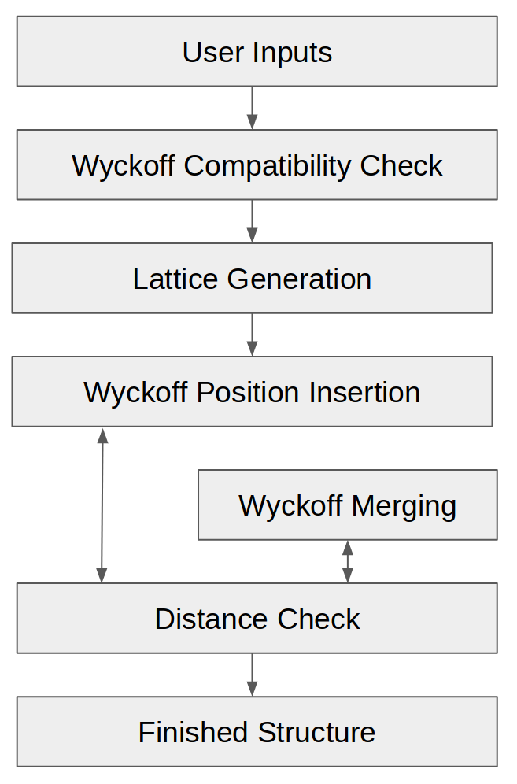

How PyXtal Works
================

PyXtal is a free, open source Python package intended to aid with crystal structure prediction. It is our aim to make our tools and theory freely available, in order to expand the knowledge and utilization of crystallographic symmetry. To this end, we outline the basic algorithms used by PyXtal. For more general information about crystallography, see the `Background and Theory <Background.html>`_ page.

Overview
--------

In order to generate random symmetrical crystals, PyXtal uses space groups and their Wyckoff positions as templates, then **inserts atoms (or molecules) one Wyckoff position at a time, until the desired stoichiometry is reached**. This ensures that the correct symmetry will be obtained, without the need to adjust atomic positions. Along the way, it checks that the atoms are sufficiently far apart. To generate a single random crystal, PyXtal performs roughly seven steps:

   PyXtal Structure Generation Flowchart. 

1) Get the input parameters from the user. This includes the crystal's stoichiometry, space group, and volume factor. Optionally, the desired lattice and allowed inter-atomic distances can also be defined (which is useful for testing at higher pressures). Otherwise, these parameters will be chosen automatically.

2) Check the compatibility of the stoichiometry with the space group. Because atoms lie in Wyckoff positions, and these can only have specific numbers of atoms in them, not every number of atoms will be able to fit into a unit cell without breaking the symmetry. To check this, we consider the full number of each type of atom, then reduce this number by the size of a Wyckoff position, beginning with the largest (general) position. If the number goes to exactly zero for each atom type, we say the stoichiometry is compatible with the space group. Additionally, we check the degrees of freedom of each Wyckoff position, so as to avoid placing multiple atoms in the same location. For molecular crystals, we also check whether the molecules can be symmetrically oriented into each Wyckoff position.

3) Generate a random lattice consistent with the space group. The cell parameters are based on both the crystal class (which determines the latice angles) and the stoichiometry (which determines the volume). Where there is some leeway for the lattice parameters, a value will be randomly chosen, with preference for more symmetrical values. If the user has defined a lattice, that will be used instead. For randomly generated lattices, we also check that the atoms or molecules can fit into the unit cell without extending outside of it.

4) Begin placing atoms into Wyckoff positions, one atomic specie at a time. First we check the multiplicity of the general Wyckoff position. If at least this number of atoms still needs to be added, then we place the atoms into the general position. If fewer atoms are needed, we instead place the atoms into a special Wyckoff position, beginning with the largest, then decreasing in multiplicity as needed. We choose a random vector between [0,0,0] and (1,1,1), and use this as the generating point for the atoms in the Wyckoff position.

5) Check that the atoms in the single Wyckoff position are not too close together. If the minimum distance is smaller than some tolerance (based on the atomic species), then we merge the Wyckoff position into a smaller special position. To do this, we first group atoms together based on the shortest distances between them, then replace the clusters with single atoms at the clusters' geometric centers. We check the Wyckoff position of the resulting cluster, then continue to merge as needed until the atoms are sufficiently far apart.

6) Check the inter-atomic distance between the newly generated Wyckoff position and the previously generated positions. If the distances are too close, we choose a new generating point within the same original Wyckoff position. For molecular crystals, we also attempt to reorient the molecule, so as to reduce the distance between atoms.

7) Continue to place Wyckoff positions and species into the crystal, until the proper stoichiometry is reached. If any step between 3-6 fails, we repeat it, up to a pre-determined maximum number of attempts. If this still fails, we go to the previous step and retry, up to a different maximum number of attempts. If we succeed, we store the information within the random_crystal class and set random_crystal.valid to True. If we fail after the maximum number of attempts, we output an error message and set random_crystal.valid to False.

If the generation succeeds, the resulting crystal can be (energetically) optimized and compared with other possible structures. After many attempts, the lowest-energy structure will be the one most likely to exist at the specified conditions. This can be used, for example, to determine the phase diagram of a solid without the need to perform any experiments.

Next, we explain the steps listed above in greater detail.

User Input
----------

Checking Compatibility
----------------------
Before attempting to generate a structure, PyXtal must make sure it is possible to do so. The WP's in different space groups have different multiplicities. As a result, not every number of atoms is compatible with every space group. For example, consider the space group Pn-3n (\#222). The smallest Wyckoff position is 2a, with the next smallest being 6b. It is impossible to create a crystal with 4 atoms in the unit cell for this symmetry group, because no combination of Wyckoff positions adds up to 4. The position 2a cannot be repeated, because it falls on the exact coordinates (1/4, 1/4, 1/4) and (3/4, 3/4, 3/4). A second set of atoms in the 2a position would overlap the atoms in the first position, but this is not physically possible.

Thus, it is necessary to check the input stoichiometry against the Wyckoff positions of the desired space group. To accomplish this, PyXtal iterates through all possible Wyckoff position combinations within the confines of the stoichiometry. As soon as one valid combination is found, the check returns true. If no valid combination is found, the check returns false, and the generation attempt fails with a warning.

Some space groups allow valid combinations of WP's, but may not give many degrees of freedom for generation. It may also be the case that the allowed combinations result in atoms which are too close together. In these cases, PyXtal will attempt generation as usual: until the maximum limit is reached, or until a successful generation occurs. If generation repeatedly fails for a given combination of space group and stoichiometry, the user should make note and avoid the combination going forward.

Lattice Generation
------------------
The first step in PyXtal's structure generation is the choice of unit cell. Depending on the symmetry group, a specific type of lattice must be generated. For all crystals, the conventional cell choice is used to avoid ambiguity. The most general case is the triclinic cell, from which other cell types can be obtained by applying various constraints.

To generate a triclinic cell, 3 real numbers are randomly chosen (using a Gaussian distribution centered at 0) as the off-diagonal values for a 3x3 shear matrix. Treating this matrix as a cell matrix, one obtains 3 lattice angles. For the lattice vector lengths, a random 3-vector between (0,0,0) and (1,1,1) is chosen (using a Gaussian distribution centered at (0.5,0.5,0.5)). The relative values of the x, y, and z coordinates are used for a, b, and c respectively, and scaled based on the required volume.

For other cell types, any free parameters are obtained using the same methods as for the triclinic case, along with any necessary constraints. In the tetragonal case, for example, all angles must be 90 degrees. Thus, only a random vector is needed to generate the lattice constants.

Generation of Wyckoff Positions
-------------------------------
The central building block for crystals in PyXtal is the Wyckoff position (WP). Once a space group and lattice are chosen, WP's are inserted one at a time to add structure.

PyXtal starts with the largest available WP, which is the general position of the space group. If the number of atoms required is equal to or greater than the size of the general position, the algorithm proceeds. If fewer atoms are needed, the next largest WP (or set of WP's) is chosen, in order of descending multiplicity. This is done to ensure that larger positions are preferred over smaller ones; this reflects the greater prevalence of larger multiplicities both statistically and in nature.

Checking Inter-atomic Distances
-------------------------------
For molecules, the process is slightly more complicated. Depending on the molecule's orientation within the lattice, the inter-atomic distances can change. Additionally, one must calculate the distances not just between molecular centers, but between every unique atom-atom pair. This increases the number of needed calculations, in rough proportion to the square of size of the molecules. As a result, this is typically the largest time cost for generation of molecular crystals.

The issue of checking the lattice is also dependent on molecular orientation. Thus, the lattice must be checked for every molecule in the crystal. To do this, the atoms in the original molecule are checked against the atoms in periodically translated copies of the molecule. Here, standard atom-atom distance checking is used.

Merging and Checking Wyckoff Positions
--------------------------------------
Once a WP is chosen, a random 3-vector between (0,0,0) and (1,1,1) is created. This acts as the generating point. Projecting this vector into the WP, one obtains a set of coordinates in real space. Then, the distances between these coordinates are checked. If the atom-atom distances are all greater than a pre-defined limit, the WP is kept and the algorithm continues. If any of the distances are too small, it is an indication that the WP would not occur with that generating point. In this case, the coordinates are merged together into a smaller WP, if possible. This merging continues until the atoms are no longer too close together (see figure \ref{fig:WyckoffMerging}).

To merge into a smaller position, the original generating point is projected into each of the remaining WP's. The WP with the smallest translation between the original point and the transformed point is chosen, so long as the new WP is a subset of the original one, and so long as the new points are not too close together. If the atoms are still too close together, the WP is discarded and another attempt is made.

Once a satisfactory WP has been filled, the inter-atomic distances between the current WP and the already-added WP's are checked. If all distances are acceptable, the algorithm continues. More WP's are then added as needed until the desired number of atoms has been reached. At this point, either a satisfactory structure has been generated, or the generation has failed. If the generation fails, then either smaller distances tolerances or a larger volume factor might increase the chances of success. However, altering these quantities too drastically may result in less realistic crystals. Common sense and system-specific intuition should be applied when adjusting these parameters.

Finding Valid Molecular Orientations
------------------------------------
In crystallography, atoms are typically assumed to be point particles with no well-defined orientation. Since the object occupying a crystallographic Wyckoff position is usually an atom, it is further assumed that the object's symmetry group contains the Wyckoff position's site symmetry as a subgroup. If this is the case, the only remaining condition for occupation of a Wyckoff position is the location within the unit cell. However, if the object is instead a molecule, then the Wyckoff position compatibility is also determined by orientation and shape.

To handle the general case, one must ensure that the object 1) is sufficiently symmetric, and 2) is oriented such that its symmetry operations are aligned with the Wyckoff site symmetry. The result is that different point group symmetries are compatible with only certain Wyckoff positions. For a given molecule and Wyckoff position, one can find all valid orientations as follows:

1. Determine the molecule's point group and point group operations. This is currently handled by Pymatgen's build-in `PointGroupAnalyzer class <https://pymatgen.org/pymatgen.symmetry.analyzer.html#pymatgen.symmetry.analyzer.PointGroupAnalyzer>`_, which produces a list of symmetry operations for the molecule.

2. Associate an axis to every symmetry operation. For now, it can be assumed that the axis is centered at the origin. For a rotation or improper rotation, use the *rotational axis*. For a mirror plane, use *an axis perpendicular to the plane*. Note that inversional symmetry does not add any constraints, since the inversion center is always located at the molecule's center of mass.

3. Find up to two non-collinear axes in the site symmetry and calculate the angle between them. Find all conjugate operations (with the same order and type) in the molecular point symmetry with the same angle between the axes, and store the rotation which maps the pairs of axes onto each other. For example, if the site symmetry were mmm, then choose two reflectional axes, say the x and y axes or the y and z axes. Then, look for two reflection operations in the molecular symmetry group. If the angle between these two operation axes is 90 degrees, store the rotation which maps the two molecular axes onto the Wyckoff axes for every pair of reflections with 90 degrees separating them.

4. For a given pair of axes, there are two rotations which can map one onto the other, with opposite directions of the molecular axis. Depending on the molecular symmetry, these two rotations may produce the same molecular orientation. Using the list of rotations calculated in step 3, remove redundant orientations which are equivalent to each other.

5. For each found orientation, check that the rotated molecule is symmetric under the Wyckoff site symmetry. To do this, simply check the site symmetry operations one at a time by transforming the molecule and checking for equivalence with the untransformed molecule.

6. For the remaining valid rotations, store the rotation matrix and the number of degrees of freedom. If two axes were used to constrain the molecule, then there are no degrees of freedom. If one axis is used, then there is one rotational degree of freedom, and store the axis about which the molecule may rotate. If no axes are used (because there are only point operations in the site symmetry), there are three (stored internally as two) degrees of freedom, meaning the molecule can be rotated freely in 3 dimensions.

PyXtal performs these steps for every Wyckoff position in the symmetry group and stores the nested list of valid orientations. When a molecule must be inserted into a Wyckoff position, an allowed orientation is randomly chosen from the list. This forces the overall symmetry group to be preserved, because symmetry-breaking positions are not allowed.

It is worth noting that the general position of any symmetry group always has site symmetry group 1. This means that any molecule can always be inserted into the general position with any orientation. However, many real crystals have molecules located in special positions, and thus this method alone is insufficient for generating realistic structures [1]_.

Another important consideration is whether a symmetry group will produce inverted copies of the constituent molecules. In many cases, a chiral molecule's mirror image will possess different chemical or biological properties \cite{chirality}. For pharmaceutical applications in particular, one may not want to consider crystals containing mirror molecules. By default, PyXtal does not generate crystals with mirror copies of chiral molecules. The user can choose to allow inversion if desired.

.. [1] U. M. ller, “3.2.4. molecular symmetry,”International Tables for Crystallography, vol. A, p.72776, 2016.
