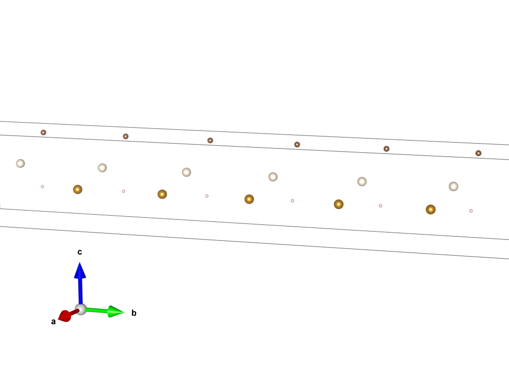
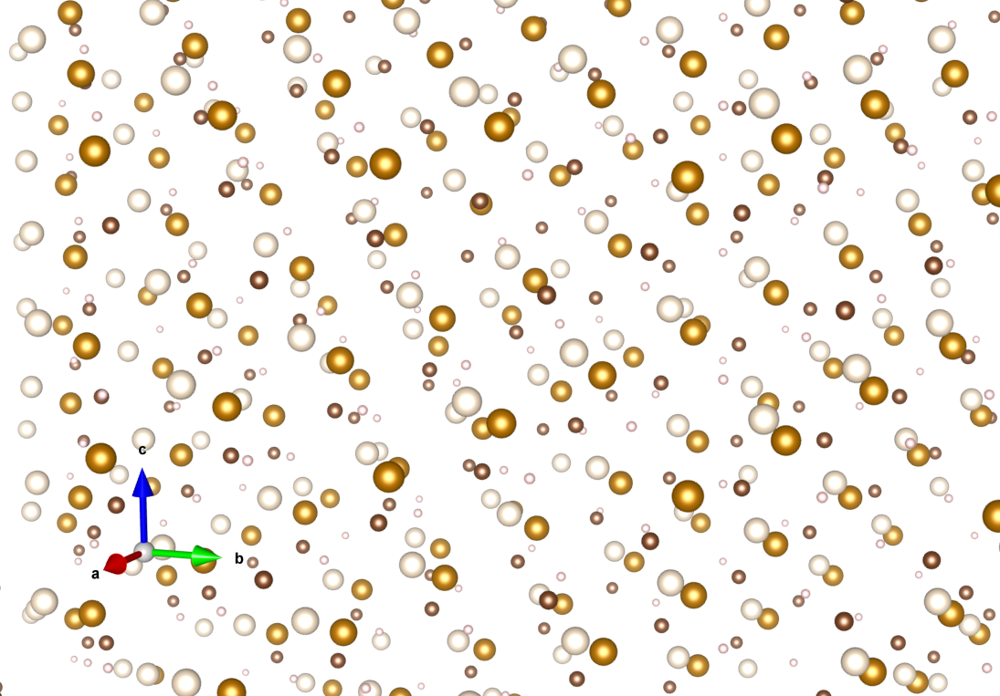
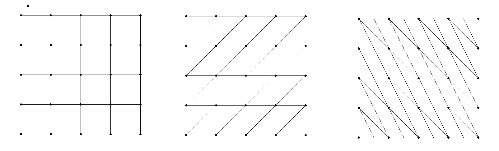
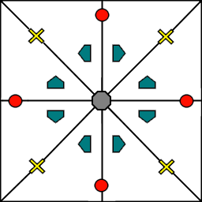

Background and Theory
=====================
This is a pedagogical introduction to crystallography and basic group theory.
For information about how PyXtal works specifically, see the
Algorithm <Algorithm.html>`_ page.

Crystals and Structures
-----------------------
When studying solids, it is often useful to describe a material's structure at
the atomic level. From this description one can (in theory) determine the
material's physical properties, including mechanical strength, electrical and
thermal conductivity, melting point, etc. Due to the near-infinite number of
possible materials and atomic geometries, it is necessary to have a consistent
mathematical framework. This is described by *crystallography*.

For an atomic structure, we could describe the geometry by specifying the type
and position of every atom. This works alright for molecules, and is in fact how
computers typically encode molecules. But for an ideal crystal, which is
infinitely large, it is impossible to describe where each individual atom lies.
Fortunately, because crystals are symmetrical, we can specify one part of the
crystal, and then use the symmetry operations to *generate* the rest of the
crystal. This creates a perfectly symmetrical structure which is infinitely
large in size. Such objects do not exist in nature, but they are nevertheless
useful for understanding small parts of real, imperfect crystals. So, we call
this infinite and symmetrical object an *ideal crystal*.

Most inorganic materials are formed by many small (nearly) ideal crystals called
*grains*. These grains may have different shapes, sizes, and orientations, but
each grain has the same crystal structure at the inter-atomic scale. If we can
determine this crystal structure, it becomes possible to predict the way that
the grains form and interact with each other. From this, we can go on to predict
properties at larger and larger scales, and determine how useful a material will
behave in different physical situations. Therefore, determining a material's
small-scale crystal structure is absolutely essential for modern materials
science and engineering.

At different pressures and temperatures, a material may go through a solid
*phase transition*, and take on a different crystal structure. So, one job of
crystallographers is to determine how a system will change under different
conditions. Often, new structures will form at high pressure, and sometimes
these structures have vastly superior properties (think diamond .v.s graphite).
Thus, high pressure physics forms an active branch of physics and chemistry,
and is a potential avenue for finding high temperature superconductors.

Periodicity, Lattices, and Unit Cells
-------------------------------------

Formally, an ideal crystal is an atomic structure that is periodic in three
dimensions. This means that when we translate the structure by a certain amount
(in any one of 3 directions unique to the crystal), the crystal will look the
same. This can be pictured in a few simple steps:

1. Define a small parallelepiped-shaped box.
2. Put atoms into the box (You can put as few or as many atoms as you like.

.. image:: ../images/unit_cell1.png
   :height: 444 px
   :width: 576 px
   :scale: 35 %
   :alt: single unit cell
   :align: center

3. Make a copy of the box and place it adjacent to the original box.

4. Make a copy of the copy, and place that adjacent to the previous one, but
along a different axis.

.. image:: ../images/unit_cell3.png
   :height: 763 px
   :width: 983 px
   :scale: 35 %
   :alt: repeated unit cell
   :align: center

5. Repeat step 4 until you have filled all of space.

We say that the resulting object has *translational symmetry*, or that it is
*periodic*. We can be more specific by defining the vectors of translational
symmetry. For a given crystal, there are 3 such linearly independent vectors.
These 3 vectors, placed into a matrix, define what is called the unit cell.
Alternatively, we can define the unit cell using the lengths of each side of the
box (usually called a, b, c), along with the angles between them (usually called
:math:`alpha, beta, gamma`). These 6 values are called the cell parameters. The
unit cell is any parallepiped-shaped part of the crystal which can be used to
generate the rest of the crystal through translations alone. Any unit cell which
has the smallest possible volume is called a *primitive cell*.

Note: a given crystal can have multiple ways to define a primitive cell, and
there is not always a clearly preferred choice. Consider a 2-dimensional square
lattice. You could just as well define the lattice using parallelograms which
run along the diagonal lines:

To avoid this confusion, there is a set of standards (defined in the
`International Tables of Crystallography <https://it.iucr.org/>`_) which is
typically used. A cell based on these standards is called the *conventional cell*.
In many cases, the conventional cell is not actually a primitive cell. Instead,
the conventional cell may have extra atoms which exist in specific locations
within the cell. So the cell type is determined both by the cell parameters,
and by any additional atomic sites within the cell.

Different cell parameters lead to different rotational symmetries of the unit
cell (we will discuss this more below). Based on these symmetries, unit cells
can be divided into seven different ``crystal classes``. Each crystal class has
a different range of allowable cell parameters; triclinic is the general class,
requiring no symmetry. Combining these restrictions with possible extra lattice
positions, we get 14 possible types of lattices, called the *Bravais lattices*.
We list these here:

.. list-table::

    * - .. figure:: ../images/triclinic.png
            :scale: 80% %
            :figclass: align-center

            Triclinic

      - .. figure:: ../images/monoclinic_P.png
            :scale: 80% %
            :figclass: align-center

            P-monoclinic

      - .. figure:: ../images/monoclinic_C.png
            :scale: 80 %
            :figclass: align-center

            C-monoclinic

      - .. figure:: ../images/orthorhombic_P.png
            :scale: 80 %
            :figclass: align-center

            P-orthorhombic

    * - .. figure:: ../images/orthorhombic_C.png
            :scale: 80 %
            :figclass: align-center

            C-orthorhombic

      - .. figure:: ../images/orthorhombic_I.png
            :scale: 80 %
            :figclass: align-center

            B-orthorhombic

      - .. figure:: ../images/orthorhombic_F.png
            :scale: 80 %
            :figclass: align-center

            F-orthorhombic

      - .. figure:: ../images/tetragonal_P.png
            :scale: 80 %
            :figclass: align-center

            P-tetragonal

.. list-table::

    * - .. figure:: ../images/tetragonal_I.png
            :scale: 100 %
            :figclass: align-center

            B-tetragonal

      - .. figure:: ../images/hexagonal.png
            :scale: 100 %
            :figclass: align-center

            Hexagonal

      - .. figure:: ../images/rhombohedral.png
            :scale: 100 %
            :figclass: align-center

            Rhombohedral

    * - .. figure:: ../images/cubic_P.png
            :scale: 100 %
            :figclass: align-center

            R-cubic

      - .. figure:: ../images/cubic_I.png
            :scale: 100 %
            :figclass: align-center

            Body-centered cubic

      - .. figure:: ../images/cubic_F.png
           :scale: 100 %
           :figclass: align-center

           Face-centered cubic [#]_

Much like squares can be considered a special case of rectangles, all unit cells
can be thought of as special cases of triclinic cells. Cubic cells are a subset
of tetragonal cells, tetragonal cells are a subset of orthorhombic cells, and so
on. The hexagonal and trigonal lattices are somewhat special cases. They can be
generated using either trigonal/hexagonal prisms, or using the standard
parallelepiped shape. For consistency, the parallelepiped is always used. Note
that despite using a parallelepiped, this is still called a hexagonal cell choice.
Some lattices can be generated using a rhombohedral unit cell. Such space groups
begin with an ``R``, and always have trigonal symmetry. For these cases, we
again use the hexagonal cell.

Whenever possible, PyXtal uses the same choices of unit cell as the Bilbao
Crystallographic Server, which in turn uses the standard conventional cell.
For a complete list of the cell choices used by PyXtal, see the
`Group Settings <html/Settings.html>`_ page.

Typically, to describe coordinates within a crystal, we use what are called
*fractional coordinates*. Fractional coordinates use the lattice vectors as the
basis, as opposed to *absolute coordinates*, which use Euclidean space as the
basis. This makes it easier to describe two similar structures that differ only
in their lattice values. Unless otherwise specified, any listed coordinates are
fractional coordinates.

.. image:: ../images/fractional.png
   :height: 351 px
   :width: 481 px
   :scale: 100 %
   :alt: fractional vs absolute coordinates

It is important to note that when periodicity is present, multiple coordinates
can actually correspond to the same point, at least in notation. It is common
practice to convert all coordintaes to lie within the range [0, 1) for periodic
axes. So, for example, if we have a point at ``(1.4,-0.3,0.6)``, it will usually
be written as ``(0.4,0.7,0.6)``. This is because it is assumed that each unit
cell is the same. In other words, an atom located at ``(1.4,-0.3,0.6)`` implies
that another atom is located at ``(0.4,0.7,0.6)``. So, it is more convenient to
only consider the unit cell which lies between ``(0,0,0)`` and ``(1,1,1)``.

Symmetry Operations
-------------------

Translations are just one kind of transformation operation. More generally, we
can perform any 3-dimensional transformation which preserves the lengths and
angles between atoms. This means we can also apply rotations, reflections, and
inversions, as well as any combination of these. Note that successive operations
do not generally commute. That is, the order of operations determines the final
outcome.

A symmetry operation is any transformation which leaves the original structure
unchanged. In other words, if the structure looks the same before and after a
transformation, then that transformation is a symmetry operation of the object.
This includes the identity operation (doing nothing to the object), which means
that every object has at least a trivial symmetry.

We can artificially split a transformation into two parts: the rotational and
inversional part (given by a 3x3 matrix), and the translational part (given by a
3D vector, specifically a 3x1 column matrix). Often, we denote this as a
matrix-column pair ``(P,p)`` or ``(P|p)``, where the capital letter *P* represents
the rotation matrix, and the lowercase letter *p* represents the translation vector.

We can define the 3x3 rotation matrix by using 3 orthogonal unit vectors as the
columns. The resulting matrix is orthogonal, meaning the determinant is either
+1 or -1. If only a rotation is applied, then the determinant is +1, and if an
inversion is applied, the determinant is -1. If an object has no symmetry
operations with determinant -1, it is said to be **chiral**. In this case, the
object's mirror image is different from the original, and cannot be rotated to
match its **twin**. This is especially important for molecules with biochemical
applications, since the mirror molecule may have a different effect.

Now, we can define how one operation is applied to another. We consider two
operations: ``(P,p)`` and ``(Q,q)``. If we first apply ``(P,p)``, followed by
``(Q,q)``, then we get a new operation, which we will call ``(R,r): (Q,q)(P,p) = (R,r)``.
Note that we apply operations from the left. Then, the relationships are:

``R = Q*P``

``r = Q*p + q``

where * denotes standard matrix multiplication. From this definition, we see that
the rotation is always applied first, followed by the translation. This rule
applies for multiple operations as well; with 3 operations ``(R,r)(Q,q)(P,p)``,
we first apply ``(P,p)``, then ``(Q,q)``, then ``(R,r)``.

Alternatively, the matrix-column pair can be **combined** into a single 4x4
matrix. We simply place the vector to the right of the rotation matrix, place
0's on the bottom row, and place a 1 in the lower right-hand corner:

.. image:: ../images/matrix4x4.png
   :height: 343 px
   :width: 828 px
   :scale: 50%
   :alt: fractional vs absolute coordinates

This matrix is called an ``affine transformation matrix``. With it, we can apply
operations using a single matrix multiplication operation. Although this may
seem like just a mathematical trick, the affine matrix notation highlights the
group structure of the transformations, as it allows translations and rotations
to be placed on equal footing. Furthermore, we can use the additional dimension
to represent time: the '1' value can be thought of as a single step forward in
time, and thus we can define both rotational and translational reference frames
(and equivalently, torques and forces) with a single 4x4 matrix. Objects which
are (periodically) symmetric in time are called time crystals. Such objects have
only recently been synthesized in the lab, and there is likely more research to
be done. However, for most applications in crystallography, time is not a factor,
and we consider only spatial symmetries.

Sometimes crystallographers express an affine transformation as a list of letters
and numbers, separated by commas (for example, ``x,y,z``). In this notation, the
first, second, and third positions denote what happens to the unit x, y, and z
axes, respectively. So if we want to perform an inversion, we replace each axis
with its opposite. Then, ``x,y,z`` becomes ``-x,-y,-z``. So, you can use
``-x,-y,-z`` to represent an inversion. Similarly, ``y,-x,z`` would represent a
90 degree rotation about the z axis (using the right hand rule). You can also
map to a linear combination of axes, or add a constant value. So, you might see
something like ``x-y,x,z+1/2``. Here, we just follow the same procedure: x, which
is the vector (1,0,0) is mapped onto ``x-y``, which is the vector ``(1,-1,0)``.
``y (0,1,0)`` is mapped onto ``x (1,0,0)``, and ``z (0,0,1)`` is mapped onto
``z+1/2 (0,0,1)``, or in the 4x4 notation, ``(0,0,1,.5)``. To express the
addition of a constant (in this case 1/2 for the z-axis), the right-hand side of
the 4x4 matrix is used. So, we would write ``x-y,x,z+1/2`` as:

.. image:: ../images/affine_matrix.png
   :height: 126 px
   :width: 174 px
   :scale: 100%
   :alt: [[1,-1,0,0],[1,0,0,0],[0,0,1,0.5],[0,0,0,1]]

Note that the mapped vectors are written as rows, NOT columns. So, ``x-y`` is
written on the first row as ``(1,-1,0,0)``. Again, the bottom row is always
``(0,0,0,1)``, so that matrix multiplication is preserved.

Groups
------

Symmetry operations have several nice properties, and this allows certain sets
of them to be classified as a mathematical object called a group. There are
several simple and intuitive examples of groups, which we will discuss below.
Formally, a group G is a set of mathematical objects (called elements) with 4
properties:

1) There is a binary operation which maps any two elements in the set onto a
third element which is also in the set: ``A*B = C``. The operation must be
defined for every possible pair on the set, and must map onto an element which
is inside of the set.

2) There must be exactly one identity element ``I`` which maps every element of
the set onto itself: ``A*I = I*A = A`` for every A in G.

3) Every element ``A`` must have an inverse ``A^-1``, such that multiplication
by the inverse gives the identity: ``A*A^-1 = A^-1*A = I``.

4) The operation * must be associative. That is, ``(A*B)*C = A*(B*C)``.

Note that commutativity is not a requirement for groups, but associativity is.
Anticommutativity has important implications for describing rotations and angular
momentum in 3 dimensions, which are beyond the scope of this study.

One of the simplest examples of a group is the additive group of real integers
``(Z,+)``. Here, the set is that of the integers ``(-1, 0, 1, ...)``, and the
operation is addition. Here, the inverse of a number is just its negative.
For example, the inverse of -2 is 2. One can easily verify that the 4 properties
listed above hold true for this group. Similarly, we can consider the additive
group of real numbers ``(R,+)``, or the additive group of complex numbers ``(C,+)``.

However, if we replace addition with multiplication, then we no longer have a
group, because the element 0 does not have a multiplicitive inverse: any number
multiplied by 0 is 0, but any number divided by 0 is undefined. We can fix this
by considering the multiplicative group of all numbers except for 0. Or,
equivalently, we can consider the multiplicitave group exp(x), where x is any
complex number. Then, the inverse is defined as exp(-x), and the identity
element is exp(0) = 1.

Interestingly, the  real numbers are a subset of the complex numbers, and yet
both the complex numbers and the real numbers form groups in their own right.
In this case, we call the real numbers a subgroup of the complex numbers.
Likewise, we call the complex numbers a supergroup of the real numbers. More
specifically, we say that the real numbers are a proper subgroup of the complex
numbers, because there are fewer real numbers than complex numbers. Likewise,
the complex numbers form a proper supergroup of the real numbers. So, a group is
always both a subgroup and a supergroup of itself, but is never a proper
subgroup or proper supergroup of itself.

These are so far all examples of infinite groups, since there are infinitely
many points on the number line. However, there also exist finite groups. For
example, consider the permutation group of 3 objects (we'll call them ``a``,
``b``, and ``c``). Our group elements are:

::

    1: (a,b,c)
    2: (a,c,b)
    3: (b,a,c)
    4: (b,c,a)
    5: (c,a,b)
    6: (c,b,a)

As you can see, there are only 6 elements in this group. Element (1) is the
identity, as it represents keeping ``a``, ``b``, and ``c`` in their original
order. Element (2) represents swapping ``b`` and ``c``, element (3) represents
swapping ``a`` and ``b``, and so on.

In general, we call the number of elements in a group the order of that group.
In the example above, the order is 6. If there are an infinite number of elements
in a group (for example, the additive group of real numbers), we say the group
has infinite order. A group of order 1 is called a trivial group, because it has
only one element, and this must be the identity element. Furthermore, because
every group has an identity element, every group also contains a trivial group
as a subgroup.

Sometimes, it is inconvenient to list every member of a group. Instead, it is
often possible to list only a few elements, which can be used to determine, or
**generate** the other elements. These chosen elements are called generators.
For example, consider elements (2) and (3) in the permutation group shown above.
We can define the remaining elements (1, 4, 5, and 6) starting with only (2) and
(3) (with operations acting from the left):

::

    2 * 2 = 1 : (a,c,b) * (a,c,b) = (a,b,c)
    2 * 3 = 4 : (a,c,b) * (b,a,c) = (b,c,a)
    3 * 4 = 6 : (b,a,c) * (b,c,a) = (c,b,a)
    6 * 2 = 5 : (c,b,a) * (a,c,b) = (c,a,b)

Thus, we say that (2) and (3) are generators of the group. Typically, there is
not a single **best** choice of generators for a group. We could just as easily
have chosen (2) and (6), or (4) and (3), or some other subset as our generators.

Symmetry Groups
---------------

One can verify that the four properties of groups listed above also hold for our
4x4 transformation matrices. Thus the set of all 3D transformations (with 4x4
matrix multiplication as our operation) forms a group. Because of this, the tools
of group theory become available.

When we want to define the symmetry of an object, we specify the object's
symmetry group. A symmetry group is just the set of all of the object's symmetry
operations (described above). It turns out, the set of all symmetry operations
for an object always forms a group. The group properties (2-4) hold because we
are using 4x4 transformation matrices, which are already a group. Property (1)
holds because a symmetry group is always a closed set. This is because performing
any symmetry operations always brings us back to our original state, and
therefore combining multiple symmetry operations also brings us back to the
original state. Thus, combinations of symmetry operations are themselves symmetry
operations, and are therefore elements of the object's symmetry group.

The simplest 3D symmetry group is the trivial group (called "1"). This group has
only the identity transformation I, which means that it corresponds to a
completely asymmetrical object. For such an object, there is no transformation
(besides the identity) which brings the object back to its original state. Most
molecules have at least some rotational symmetry, and crystals always have at
least translational symmetry, so we will not encounter this group very often.

On the other hand, we can consider empty 3D space, which is perfectly symmetrical
(note: this does not apply to actual empty space, which contain gravitational
and quantum fields). The symmetry group of empty space includes not only
rotations and translations, but also scaling and shearing, since **nothing** will
always be mapped back onto **nothing**.

Note that only empty space, or other idealized objects (including some fractals)
can have scaling symmetry. For atomic structures, we will never encounter this.
However, shear symmetry is possible for lattices. As an example, consider the
different choices for the primitive cell shown in the section above. These
different primitive cells can be mapped onto each other using shear
transformations. It is important to note that in general only simple lattices
have this shearing symmetry; if there are atoms inside of the lattice, they may
not map onto other atoms in the crystal.

We can also define symmetry groups for objects of arbitrary dimension. A simple
example is the equilateral triangle, which has a 3-fold rotational symmetry, as
well as 3 reflectional symmetries. A slightly more complex example is the regular
hexagon, which has all of the symmetries of the triangle, but also 6-fold and
2-fold rotational symmetry, and additional reflectional symmetries. Combining
rotation and reflection, the hexagon also has the inversion symmetry:

.. list-table::

    * - .. figure:: ../images/triangle.png
            :scale: 75% %
            :figclass: align-center

            triangular symmetry

      - .. figure:: ../images/hexagon.png
            :scale: 40% %
            :figclass: align-center

            hexagonal symmetry

It takes practice to develop an intuition for finding symmetries, but the results
can be very rewarding. Often, a symmetry can be utilized to lessen the work
needed to solve a problem, sometimes even reducing the problem to a trivial
identity. This is a core concept in mathematics and physics, and deserves reflection.

Point Groups
~~~~~~~~~~~~

In order for an object to be translationally symmetric, it must be periodic along
one or more axes. This means that most objects (excluding crystals and certain
idealized chain molecules) can only have rotational/inversional symmetry. A 3D
symmetry group without translational symmetry is called a point group. This is
because the transformations leave at least one point of space unmoved. This
includes rotations, reflections, inversions, and combinations of the three. Note
that we can either use rotations and reflections, or rotations and inversions,
to generate the remaining point transformations. In PyXtal and the documentation,
we use rotations and inversions as the basic transformations, meaning reflections
are treated as rotoinversions.

A point group can contain rotations, reflections, and possibly inversion. There
are several conventions for naming point groups, but PyXtal uses the Schoenflies
notation. Here, point groups have one or two letters to describe the type(s) of
transformations present, and a number to describe the order. For detailed
information, see the Wikipedia page. Below are a few examples of point groups
found in crystallography and chemistry.

- :math:`H_2O`: point group C2v (2-fold rotation axis, and two mirror planes) [#]_
- Hypothetical Pmmm crystal: point group mmm (3 mirror planes)
- Buckminsterfullerene: point group Ih (Full icosahedral symmetry) [#]_

.. list-table::

    * - .. figure:: ../images/water_symmetry_1.gif
            :height: 720 px
            :width: 1024 px
            :scale: 25%
            :figclass: align-center

            :math:`H_2O` molecule (``C2v``)

      - .. figure:: ../images/Pmmm.png
            :height: 720 px
            :width: 1024 px
            :scale: 25%
            :figclass: align-center

            Hypothetical crystal (``mmm``)

      - .. figure:: ../images/Bucky.png
            :height: 720 px
            :width: 1024 px
            :scale: 25%
            :figclass: align-center

            Buckminsterfullerene (``Ih``)

Space Groups
~~~~~~~~~~~~

For crystals, we need to describe both the translational (lattice) and rotational
(point group) symmetry. A 3D symmetry group containing both of these is called a
space group, and is one of the main tools used by crystallographers. We can
separate a space group into its point group and its lattice group. Thus, space
groups can be neatly divided into the seven different crystal classes.
Mathematically, the two different types of symmetry are connected; thus, certain
kinds of translational symmetry (lattice types) can only have certain kinds of
rotational symmetry (point groups). This is apparent from the names of the space
groups; certain symbols are only found in certain lattice systems. A list of
space groups and their symmetries is provided by the
`Bilbao utility WYCKPOS <http://www.cryst.ehu.es/cryst/get_wp.html>`_. Note that
for space groups, we use the `Hermann-Mauguin (H-M) notation <https://en.wikipedia.org/wiki/Hermann%E2%80%93Mauguin_notation>`_.
This means a space group can be specified by a number between 1 and 230. However,
a space group symbol should always be provided, as the numbers are not used as
commonly. The numbers are more useful for computer applications like PyXtal or
Pymatgen, or in conjunction with references like the Bilbao server or the
International Tables.

Technically speaking, two crystals with the same lattice type and point group,
but with different cell parameters, have different space groups. The space group
is the set of all symmetry operations, and in this case the translational
symmetry operations would be different. But typically when someone says space
group, they actually mean the set of all space groups with the same lattice type
and point group. In this sense, we say that there are 230 different space groups.
This is the meaning of space group which we will use from now on, unless
otherwise specified. This is useful, since we don't need to define a new space
group every time we shrink or stretch a crystal by some small amount.

Not every rotational symmetry is compatible with a 3D lattice. Specifically, only
rotations of order 2, 3, 4, or 6 are found in real crystals (Note: pseudo-crystals
may have different local symmetries, but lack long-range periodicity). As a result,
only 32 point groups are found as subgroups of space groups. These are called the
crystallographic point groups. So, by choosing such a point group, along with a
**compatible lattice**, we define a space group. By **compatible lattice**, we
mean any lattice which maps onto itself under the symmetry operations of the
chosen point group. Because of this compatibility condition, the presence of a
particular symmetry can tell you what kind of lattice is present. For example, a
6-fold rotation always belongs to a hexagonal lattice. A 3-fold rotation about
one of the primary axes belongs to a trigonal axis, whereas a 3-fold rotation
about the diagonal belongs to a cubic lattice. In this way, the lattice type can
be determined from the Hermann-Mauguin symbol.

In reality, a crystal is often distorted slightly from its ideal symmetrical
state. As a result, two researchers may label the same crystal with different
space groups. This phenomenon is called pseudosymmetry; it is when a crystal is
close to possessing a certain space group, but is only slightly off. This is a
real problem for computational crystallography, since numerical accuracy makes
determining symmetry an imprecise business. For example, if an atom is located
at ``(0,1/3,0)``, it will be encoded as something like ``(0,.33333,0)`` due to
rounding. As a result, it will be slightly off from the expected location, and
the computer may not recognize the 3-fold symmetry. So, whenever you work with
crystal symmetry, it is a good idea to allow some numerical **tolerance**
(roughly somewhere between ``.001`` and ``.03`` Angstroms), so as to correctly
assess the symmetry. On the flip side, if a provided crystal is labeled as
having P1 symmetry (which means no rotational symmetry was found), it is likely
that some symmetry is actually present, but was not found due to numerical issues.

Wyckoff Positions
-----------------

Because symmetry operations can be thought of as making *copies* of parts of an
object, we can usually only describe part of a structure, and let symmetry
generate the rest. This small part of the structure used to generate the rest is
called the asymmetric unit. However, not all points in the asymmetric unit are
generated the same. If an atom lies within certain regions - planes, lines, or
points - then the atom may not be "copied" as many times as other atoms within
the asymmetric unit. A familiar example is in the creation of a paper snowflake.
We start with a hexagon, then fold it into a single triangle 6 sheets thick.
Then, if we cut out a mark somewhere in the middle of the triangle, the mark is
copied 6-fold. However, if we instead cut out a mark alonng the triangle's edge,
or at the tip, the marks will only have 3 or 1 copies:

These different regions are called Wyckoff positions, and the number of copies
is called the multiplicity of the *Wyckoff position*. So, if an atom lies in a
Wyckoff position with multiplicity greater than 1, then that Wyckoff position
actually corresponds to multiple atoms. However, thanks to symmetry, we can refer
to all of the copies (for that particular atom) as a single Wyckoff position.
This makes describing a crystal much easier, since we no longer need to specify
the exact location of most of the atoms. Instead, we need only list the space
group, the lattice, and the location and type of one atom from each Wyckoff
position. This is exactly how the cif file format encodes crystal data (more
info below). Just keep in mind that in this format, a single atomic entry may
correspond to multiple atoms in the unit cell.

The largest Wyckoff position, which makes a copy for every symmetry operation,
is called the general Wyckoff position, or just the general position. In the
snowflake example, this was the large inner region of the triangle. In general,
the general position will consist of every location which does not lie along
some special symmetry axis, plane, or point. For this reason, the other Wyckoff
positions are called the special Wyckoff positions.

The number and type of Wyckoff positions are different for every space group; a
list of them can be found using the
`Bilbao utility WYCKPOS <http://www.cryst.ehu.es/cryst/get_wp.html>`_. In the
utility, Wyckoff positions are described using the ``x,y,z`` notation, where
each operation shows how the original ``(x,y,z)`` point is transformed/copied.
In other words, if we choose a single set of coordinates, then plugging these
coordinates into the Wyckoff position will generate the remaining coordinates.
As an example, consider the general position of space group ``P222 (#16)``,
which consists of the points ``(x,y,z), (-x,-y,z), (-x,y,-z), and (x,-y,-z)``.
If we choose a random point, say ``(0.321,0.457,0.892)``, we can determine the
remaining points:

::

    (x,y,z)->(0.321,0.457,0.892)
    (-x,-y,z)->(0.679,0.543,0.892)
    (-x,y,-z)->(0.679,0.457,0.108)
    (x,-y,-z)->(0.321,0.543,0.108)

Here a negative value is equal to 1 minus that value (-0.321 = 1 - 0.321 = 0.679).

To denote Wyckoff positions, a combination of number and letter is used. The
number gives the multiplicity of the Wyckoff position, while the letter
differentiates between positions with the same multiplicity. The letter 'a' is
always given to the smallest Wyckoff position (usually located at the origin or
z axis), and the letter increases for positions with higher multiplicity. So,
for example, the space group ``I4mm (#107)`` has 5 different Wyckoff positions:
``2a``, ``4b``, ``8c``, ``8d``, and ``16e``. Here, ``16e`` is the general
position, since it has the largest multiplicity and last letter alphabetically.

Note that for space groups with non-simple lattices (those which begin with a
letter other than 'P'), the Wyckoff positions also contain fractional translations.
Take for example the space group ``I4mm (#107)``. The Bilbao entry can be found
`here <http://www.cryst.ehu.es/cgi-bin/cryst/programs/nph-wp-list?gnum=107>`_.
Each listed Wyckoff position coordinate has a copy which is translated by
``(0.5,0.5,0.5)``. It is inconvenient to list each of these translated copies
for every Wyckoff position, so instead a note is placed at the top. This is why
Wyckoff position ``16e`` has only 8 points listed. In this case, to generate the
full crystal, one could apply the 8 operations listed, then make a copy of the
resulting structure by translating it by the vector ``(0.5,0.5,0.5)``. Note that
in space groups beginning with letters other than P, the smallest Wyckoff
position will never have a multiplicity of 1.

In addition to the generating operations, the site symmetry of each Wyckoff
position is listed. The site symmetry is just the point group which leaves the
Wyckoff position invariant. So, if a Wyckoff position consists of an axis, then
the site symmetry might be a rotation about that axis. The general position
always has site symmetry 1, since it corresponds to choosing any arbitrary
structure or location can be made symmetrical by copying it and applying all of
the operations in the space group.

Finally, since crystals are infinitely periodic, a Wyckoff position refers not
only to the atoms inside a unit cell, but every periodic copy of those atoms in
the other unit cells. Thus, the Wyckoff position ``x,y,z`` is the same as the
position ``x+1,y+1,z``, and so on. This is usually a minor detail, but it must
be taken into account for certain computational tasks.

Molecular Wyckoff Positions
---------------------------

In most cases, it is assumed that the objects occupying Wyckoff positions will
be atoms. Because atoms are spherically symmetrical, they will always possess
the site symmetry associated with a given Wyckoff position. However, this is not
always the case for molecules, which have their own point group symmetry. Because
of this, a given molecule may or may not fit into a given Wyckoff position,
depending on its symmetry and orientation.

In order for a molecule to fit within a Wyckoff position, its point group must
be a supergroup of the position's site symmetry. In other words, the molecule
must be at least as symmetrical as the region of the Wyckoff position itself
(with reference to the operations of the space group as a whole). Furthermore,
the molecule must be oriented in such a way that its symmetry axes line up with
the symmetry axes of the Wyckoff position. As an example, consider a Wyckoff
position with site symmetry 2. This is an axis with 2-fold symmetry. Now consider
a water molecule lying on this axis. In order to truly occupy the Wyckoff
position, the water molecule's 2-fold axis must line up with the Wyckoff
position's (See the water molecule image above).

For larger site symmetry groups, it is more complicated to check if a molecule
will fit or not. The algorithm used by PyXtal for doing this is detailed in the
`How PyXtal Works <Algorithm.html>`_ page.

Crystal File Formats
--------------------

There are two main file formats used for storing crystal structures: cif and
POSCAR. Each of these has standard definitions.
`Here <https://www.iucr.org/resources/cif/spec/version1.1/cifsyntax>`_ is the
cif file definition (given by the International Tables), and
`here <https://cms.mpi.univie.ac.at/vasp/vasp/POSCAR_file.html>`_ is the POSCAR
file definition (given by Vasp).

Cif uses the space group symmetry to compress the data. The core information
consists of the space group, the lattice, and the location and type of a single
atom from each Wyckoff position. So, for high symmetry space groups, a cif file
can be much smaller than a POSCAR file. As with any type of compression, the cif
file has the downside that the program using it must be able to work with
symmetry operations. Specifically, each Wyckoff position's generating atom must
be copied using the symmetry operations, so that the entire unit cell can be known.

In contrast, a POSCAR file does not provide the symmetry information, but instead
specifies the type and location of every atom in the unit cell, including those
which are symmetrical copies of each other. This results in a larger file, but
one that is easier to read, since no symmetry operations need to be applied. The
downside is that if one wishes to know the space group, it must either be
calculated, or given by some external source.

Each format has advantages and disadvantages. A computational crystallographer
should be familiar with both, and understand the differences. If you provide a
POSCAR file for a structure, you should also provide the symmetry group.
Likewise, if you provide a cif file, you should be certain that the symmetry
information is correct, and that you are using the correct space group setting.

.. [#] Images from https://en.wikipedia.org/wiki/Crystal_structure

.. [#] Image from "Molecular Orbitals for Water (H2O)"http://www1.lsbu.ac.uk/php-cgiwrap/water/pfp.php3?page=http://www1.lsbu.ac.uk/water/h2o_orbitals.html)

.. [#] Image from https://en.wikipedia.org/wiki/Buckminsterfullerene#/media/File:Buckminsterfullerene-perspective-3D-balls.png
