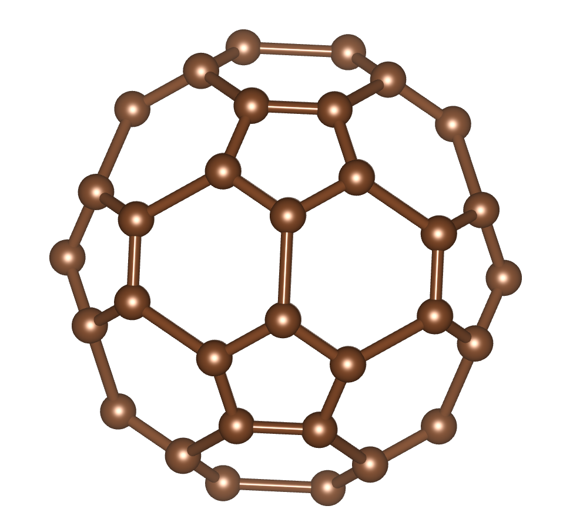
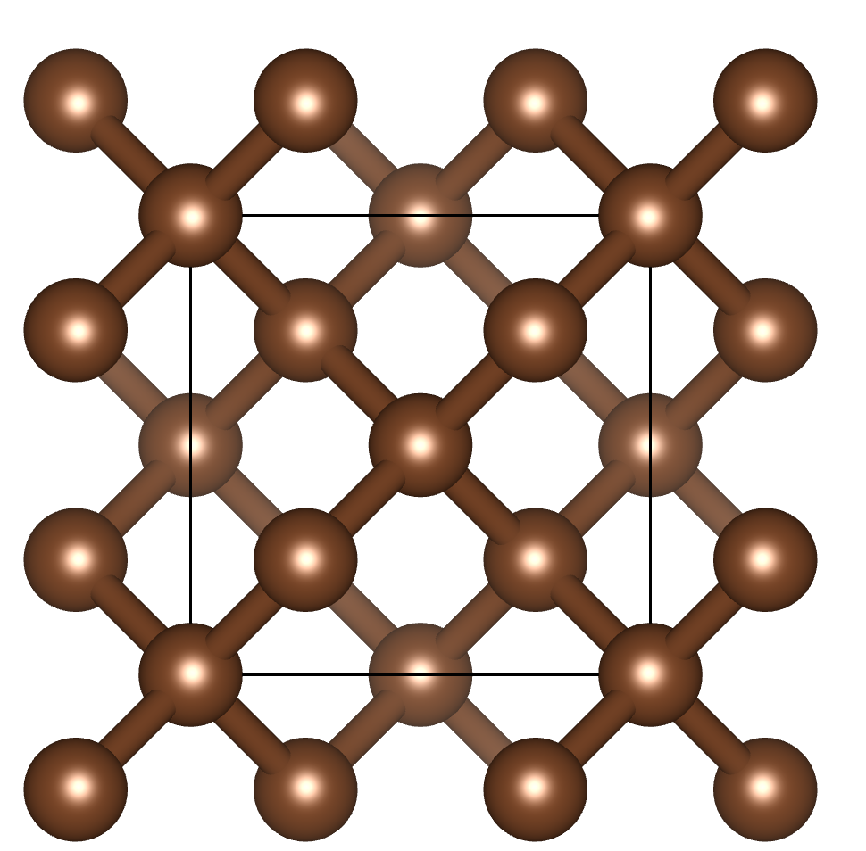
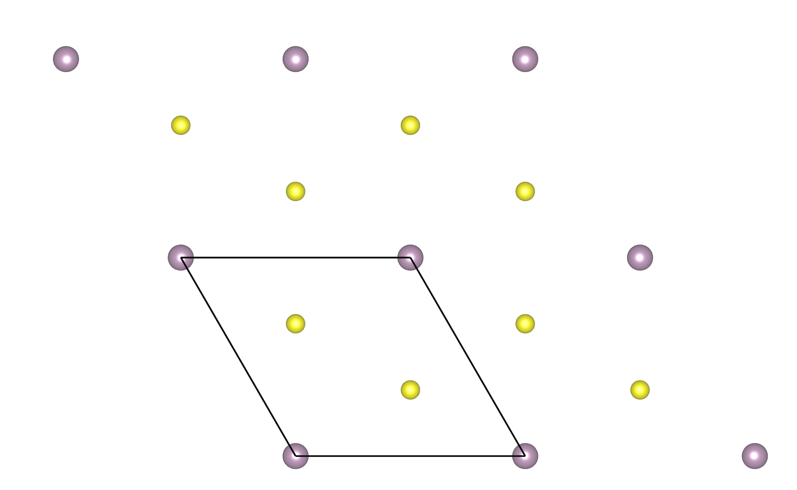
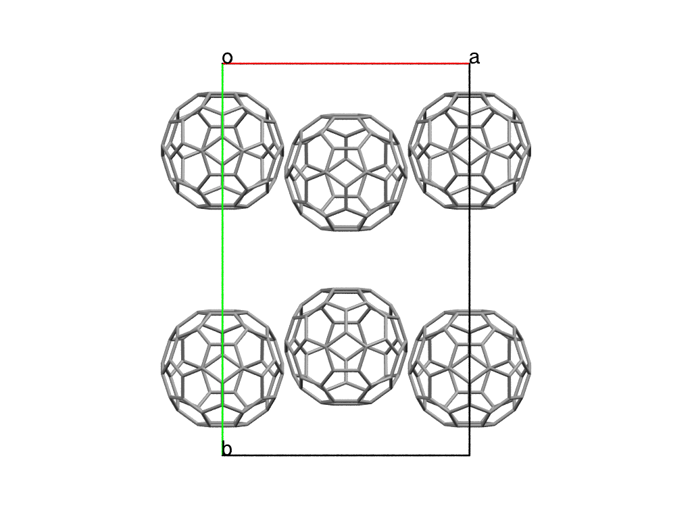

Run PyXtal executables
======================

Currently, we provide several utilities to the users so that they can run the
code from command line with Python scripting.
They include:

- ``Pyxtal_main.py``: a tool to generate atomic/molecular crystals
- ``Pyxtal_symmetry.py``: a tool to access the symmetry information

After a successfull `installation <Installation.html>`_, all of them can be
accessed by invoking the ``-h`` command:

::

    $ pyxtal_main.py -h
                 ______       _    _          _
                (_____ \     \ \  / /        | |
                 _____) )   _ \ \/ / |_  ____| |
                |  ____/ | | | )  (|  _)/ _  | |
                | |    | |_| |/ /\ \ |_( (_| | |___
                |_|     \__  /_/  \_\___)__|_|_____)
                       (____/

    ----------------------(version 0.1.4 )----------------------

    A Python package for random crystal generation
    The source code is available at https://github.com/qzhu2017/pyxtal
    Developed by Zhu's group at University of Nevada Las Vegas

    usage: pyxtal_main.py [-h] [-s sg] [-e element] [-n numIons] [-f factor]
                          [-a attempts] [-o outdir] [-d dimension] [-t thickness]
                          [-m]

    optional arguments:
      -h, --help            show this help message and exit
      -s sg, --symmetry sg  desired symmetry, number or string, e.g., 36, Pbca, Ih
      -e element, --element element
                            desired elements: e.g., Li
      -n numIons, --numIons numIons/numMols
                            desired numbers of atoms: 16
      -f factor, --factor factor
                            volume factor: default 1.0
      -a attempts, --attempts attempts
                            number of crystals to generate: default 1
      -o outdir, --outdir outdir
                            Directory for storing output cif files: default 'out'
      -d dimension, --dimension dimension
                            desired dimension: (3, 2, 1, 0): default 3
      -t thickness, --thickness thickness
                            Thickness of a 2D crystal, or area of a 1D crystal,
                            None generates a value automatically: default None
      -m, --molecular       molecular? default: False

PyXtal_symmetry utility
------------------------
``PyXtal_symmetry.py`` is a utility to handle the generation of moelcular crystals.

- `-d`, the dimension, e.g., ``3``, ``2``, ``1``, ``0``. The defult is ``3``.
- `-s`: the target symmetry, either by *string* (e.g., ``Ih``, ``Pbca``) and *integer* (``61``).

::

    $ pyxtal_symmetry.py -s 36

    -- Space group # 36 (Cmc2_1)--
    8b site symm: 1
      x, y, z
      -x, -y, z+1/2
      x, -y, z+1/2
      -x, y, z
      x+1/2, y+1/2, z
      -x+1/2, -y+1/2, z+1/2
      x+1/2, -y+1/2, z+1/2
      -x+1/2, y+1/2, z
    4a site symm: m..
      0, y, z
      0, -y, z+1/2
      1/2, y+1/2, z
      1/2, -y+1/2, z+1/2

::

    $ pyxtal_symmetry.py -s 20 -d 2

    -- Layer group # 20 (p2_122)--
    4d site symm: 1
      x, y, z
      x+1/2, -y, -z
      -x+1/2, y, -z
      -x, -y, z
    2c site symm: .2.
      1/4, y, 0
      3/4, -y, 0
    2b site symm: ..2
      0, 1/2, z
      1/2, 1/2, -z
    2a site symm: ..2
      0, 0, z
      1/2, 0, -z

if the ``-s`` tag is not given, it will output the list of all possible symmetry
groups for the given dimension.

::

    $ pyxtal_symmetry.py -d 3
        space_group
    1            P1
    2           P-1
    3            P2
    4          P2_1
    5            C2
    6            Pm
    7            Pc
    8            Cm
    9            Cc
    10         P2/m
    11       P2_1/m
    12         C2/m
    13         P2/c
    14       P2_1/c
    15         C2/c
    16         P222
    17       P222_1
    18     P2_12_12
    19   P2_12_12_1
    20       C222_1
    ...
    ...
    212       P4332
    213      P4_132
    214      I4_132
    215       P-43m
    216       F-43m
    217       I-43m
    218       P-43n
    219       F-43c
    220       I-43d
    221       Pm-3m
    222       Pn-3n
    223       Pm-3n
    224       Pn-3m
    225       Fm-3m
    226       Fm-3c
    227       Fd-3m
    228       Fd-3c
    229       Im-3m
    230       Ia-3d

PyXtal_main utility
--------------------
``PyXtal_main.py`` is a utility to handle the generation of atomic crystals.
Typically, four arguments are requried to describe the target structure:

- `-d`, the dimension, e.g., ``3``, ``2``, ``1``, ``0``.
- `-s`: the target symmetry (*space*, *layer*, *rod*, *point* group information), either by *string* (e.g., ``Ih``, ``Pbca``) and *integer* (``61``).
- `-e`: the list of elements, e.g., ``Si``, ``Si, O``
- `-n`: the number of atoms in the target primitive unit cell, e.g., ``12``, ``4, 8``. The size should be consistent with the ``-e`` tag.

For **group setting**, please refer to the `Group Setting page <Settings.html>`_.
**To our knowledge, PyXtal is perhaps the only open source code which can handle
the crystal symmetry generation from 0 to 3 dimensional systems.**
Below we will introduce its capability in detail.

A quick example of C60
~~~~~~~~~~~~~~~~~~~~~~

Below is a quick example to generate a random ``C60`` clusters with icosahedral
(``Ih``) symmetry.

::

    $ pyxtal_main.py -e C -n 60 -d 0 -s Ih

    Symmetry requested: 56(Ih), generated: Ih
    Output to out/C60.xyz

As described in the screen output, the run will generate a file called
``out/C60.xyz`` which stores the structural information about C60.
One can thus visualize via different third-party packages. For instance,
below is the output from `VESTA <https://jp-minerals.org/vesta/en/>`_.

Note that this is a random process. So each time the structure is different.

3D crystals
~~~~~~~~~~~~~~~~~~~~~~
By default, ``-d`` tag is 3, which means to generate 3D crystal. Below is a
quick example to generate a diamond like crystals for carbon.

::

    $ pyxtal_main.py -e C -n 8 -s 227

    Symmetry requested: 227(Fd-3m), generated: Fd-3m
    Output to out/C8.cif

It is important to note that we specified ``8`` for ``-n`` tag, which means 8
carbon atoms in the conventional unit cell.

2D and 1D crystals
~~~~~~~~~~~~~~~~~~~~~~
2D and 1D crystals need one more argument to specify the confinement. For 2D
crystal, the ``thickness`` needs to be provided through ``-t`` tag in Angstrom.
Below is an example fo generating a 2D MoS2 crystal.

::

    $ pyxtal_main.py -e Mo,S -n 1,2 -s 77 -d 2 -t 2.4

    Symmetry requested: 77(p6mm), generated: P6mm
    Output to out/Mo1S2.cif

Molecular crystals occupying general Wyckoff positions
~~~~~~~~~~~~~~~~~~~~~~~~~~~~~~~~~~~~~~~~~~~~~~~~~~~~~~~
Below is an example to generate of random crystal for a famous drug molecule ROY.

::

    $ pyxtal_main.py -m -e ROY -n 4 -s P2_12_12_1

    Symmetry requested: 19 (P2_12_12_1), generated: P2_12_12_1, vol: 2895.37 A^3
    Output to out/S4O8N12C48H36.cif

.. image:: ../images/ROY.png
   :height: 763 px
   :width: 963 px
   :scale: 30 %
   :align: center

Molecular crystals occupying special Wyckoff positions
~~~~~~~~~~~~~~~~~~~~~~~~~~~~~~~~~~~~~~~~~~~~~~~~~~~~~~
An import feature of PyXtal is that the program can automatically generate
molecular crystals occupying special Wyckoff positions. This is very useful for
molecules with high internal symmetry. During crystallization, these molecule
can occupy some special Wyckoff positions as long as the site symmetry is
compatible with the molecular symmetry. For instance, the space group ``Cmc_21``
has 4 symmetry operations (``mm2``) in its primitive cell. However, we can still
generate a structure with 2 molecules for C60 by placing them to the special
Wyckoff position. This will be automatically processed by our
`internal algorithm <Algorithm.html#finding-valid-molecular-orientations>`_.

::

    $ pyxtal_main.py -m -e C60 -n 2 -s 36

How to define the molecules?
~~~~~~~~~~~~~~~~~~~~~~~~~~~~
Please ref to the section of `Molecule <Usage.html#molecule-in-pyxtal>`_.
